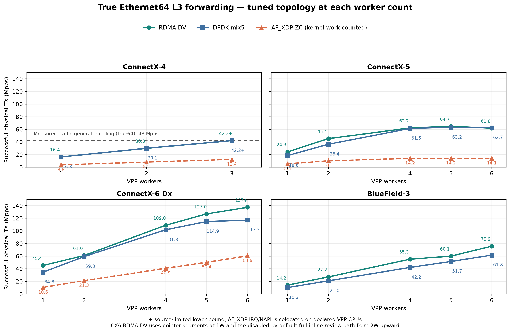
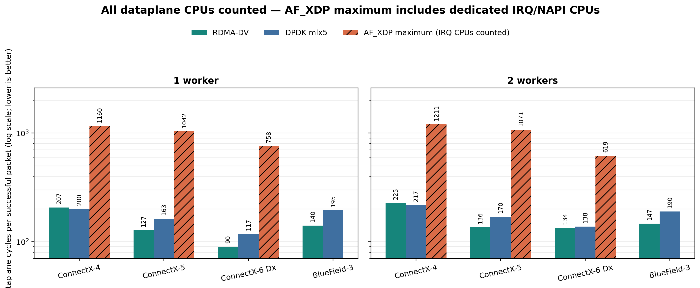
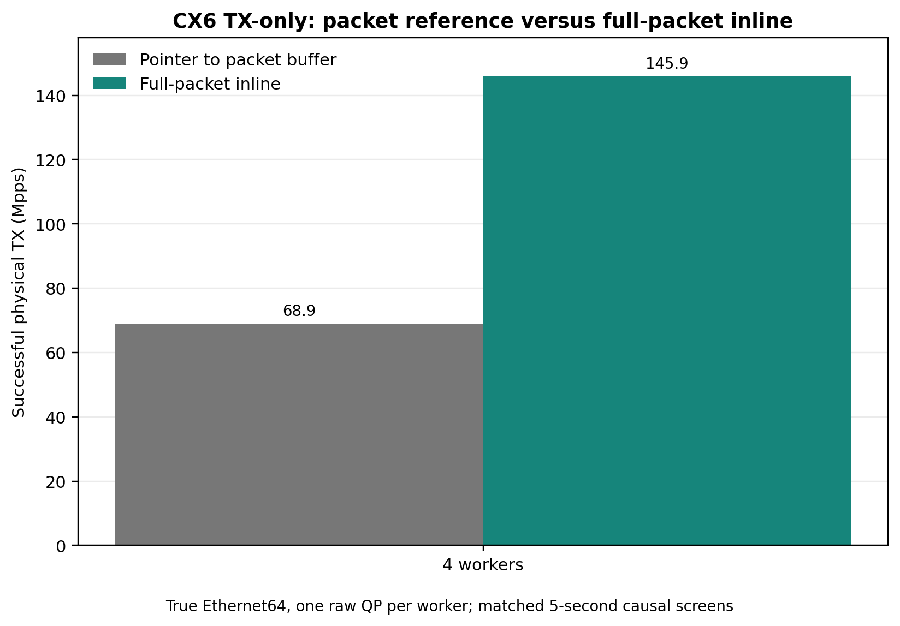

# Three VPP datapaths for NVIDIA ConnectX and BlueField at 64 bytes

> **Code provenance.** Some retained rows use disabled-by-default review code.
> Exact revisions and the status of every affected result are published with
> the dataset.

*A best-found-configuration comparison of native RDMA-DV, DPDK mlx5 and
AF_XDP zero-copy for same-port IPv4 forwarding.*

VPP has three practical high-performance options for NVIDIA ConnectX adapters
and BlueField DPUs. The native RDMA plugin accesses mlx5 queues through Direct
Verbs (DV), the DPDK plugin uses the mlx5 PMD, and the AF_XDP plugin uses Linux
zero-copy sockets. This study tunes queue count, descriptor depth, placement
and applicable driver controls independently for each option, then reports
the best qualified results found with physical 64-byte Ethernet frames.

The resulting curves show a consistent native-versus-kernel difference:
**RDMA-DV is faster than AF_XDP at every matched worker count on every measured
adapter.** It forwards 2.27 to 4.57 times as many packets, while AF_XDP consumes 2.25 to
4.53 times as many dataplane-CPU cycles per successful packet. Those cycles
are not estimated: IRQ, NAPI, XDP and XSK work is counted on the same declared
CPUs as VPP.

DPDK is the useful second control because it also polls the NIC from VPP.
Across CX5, CX6 and BF3, RDMA-DV leads tuned DPDK in 14 of 15 paired cells;
the sole exception is CX5 at six workers, by 1.5%. CX4 is effectively a draw.
The underlying transmit mechanisms are examined only after the results.

## What was measured

The DUT receives an IPv4/UDP frame and routes it back through the **same
physical port**. Every successful packet performs IPv4 lookup, TTL decrement,
checksum update, adjacency rewrite and physical retransmission. This is not an
RDMA endpoint workload, an RX-only loop or a two-port wire.

NIC counters confirm that every retained result uses 64-byte Ethernet frames.

Throughput is the DUT's successful physical TX delta. It is not VPP's TX
attempt counter. Finals are three independent 20-second windows. Main and
worker threads use distinct physical cores; SMT siblings are excluded. RXQ
and TXQ/QP ownership is captured for every cell. Aggregate load per worker
targets a spread below 1%. A larger cell is retained only when the measured
spread matches the smallest possible finite-flow/RETA quantization step; that
floor is then published explicitly. Individual RXQ spread is disclosed
separately when a worker polls several queues.

The word *maximum* matters. Several points deliberately overload the DUT to
prove source headroom, so `rx-miss`, RX discard or TX backpressure can advance.
They are maximum forwarding rate (MRR), not zero-loss NDR. A `+` below marks a
source-limited lower bound. CPU cost is aggregate dataplane cycles divided by
successful physical TX packets. The separate VPP main core is disclosed in
the CSV. For AF_XDP, CPU-wide counters on the declared main and worker CPUs
include colocated IRQ/NAPI and kernel XSK work; no auxiliary packet-service
CPU is allowed in the retained matrix.



## What the curves say

The throughput figure carries every retained value, so it is the result
matrix. Across matched cells, RDMA-DV is 3.40--4.36 times faster than AF_XDP
on CX4, 4.40--4.57 times faster on CX5, and 2.27--4.28 times faster on CX6.
AF_XDP was not measured on BF3 by study scope; this is not a capability claim.

DPDK remains fully visible in the same figure. BF3 is the strongest native-
versus-DPDK result: RDMA-DV leads by 38.5%, 29.4%, 31.0%, 16.4% and 22.8% at
one, two, four, five and six workers. CX6 also favors native at every retained
count. The CX5 6W reversal is deliberately left visible: DPDK leads there by
1.5%.

The CPU view tells the same story from the other side. It shows aggregate
worker-CPU cycles per successfully transmitted packet; for AF_XDP those bars
include all kernel execution on the colocated IRQ/NAPI CPUs. The native driver
needs roughly 90--218 cycles per packet in the illustrated 1W/2W cells,
against 381--866 for AF_XDP. DPDK remains much closer to native because both
paths poll device queues directly from VPP.



Two limits matter when reading the throughput curve. CX4 reaches its measured
42.63-Mpps traffic-generator ceiling at three poll-mode workers, so those two
points are lower bounds. CX6 RDMA-DV at six workers is likewise source-limited
at 137.4 Mpps. Neither boundary applies to the AF_XDP points.

## What separates the three datapaths

The native plugin receives directly into VPP buffers and consumes mlx5 CQEs
from the VPP worker. It avoids both the kernel XDP/XSK machinery used by
AF_XDP and the ethdev/`rte_mbuf` boundary used by DPDK. On CX5, CX6 and BF3 it
also groups compatible packets into enhanced Multi-Packet WQEs (eMPW); CX4 is
the legacy-SEND control.

BF3 makes the architectural benefit particularly clear. Native pointer eMPW
is faster than the tuned DPDK PMD at every retained worker count even though
forced full-packet inline hurts native BF3. The win is therefore not created
by choosing a favorable copy policy: the shorter DV path itself matters.

CX4 keeps the comparison honest. Without eMPW, RDMA-DV and DPDK are within
0.6% at one and two workers and both hit the source at three. CX6 is the
opposite control: once both paths use complete-packet eMPW inline, native
overtakes DPDK and continues scaling. **When the hardware exposes the batching
capability, DV gives VPP an unusually efficient fast path without requiring
an ethdev abstraction layer.**

## ConnectX-6: the 53-Mpps mystery was in the WQE

The original native curve looked suspicious: 45.37 Mpps with one worker,
52.81 with two, then 53.23, 53.45 and 53.01 with four, five and six. RX queues
were balanced, every worker owned a dedicated raw QP, the main QP was idle and
the source had headroom. More QPs, deeper SQs, fewer requested CQEs, UAR
placement, firmware policy and larger buffer pools did not move the plateau.
The rising CPU cost described the symptom exactly, but did not explain it:

```text
2 × 90.15 / 154.93 = 1.164
52.81 / 45.37      = 1.164
```

The decisive experiment removed RX, RSS, lookup and graph dispatch. In the
old native eMPW path, every 60-byte packet remained in a VPP buffer and the WQE
contained an address/lkey/length data segment. The NIC therefore fetched each
packet through a separate DMA-read/service operation. The prototype instead
copies the complete packet into the eMPW WQE, using the same representation as
the DPDK mlx5 inline burst.

At four workers, that one boundary moves TX-only throughput from 68.868 Mpps
with pointer data segments to 140.816 Mpps with full inline while retaining
buffers until completion. Releasing a buffer immediately after the SQ copy
raises it only another 3.6%, to **145.862 Mpps**. The main gain is therefore
the elimination of per-packet external reads, not buffer lifetime. The result
is 98.0% of the 148.81-Mpps Ethernet64 packet-rate ceiling.



This does not claim that aggregate PCIe byte bandwidth was exhausted. It
localizes the limit to the transaction/service cost of pointer data segments:
the same card, link, QPs, UARs and workers transmit twice as many packets when
the bytes are already in the posted WQE.

The full L3 finals keep one dedicated QP per worker and an inactive main QP.
At 2W, the measured warm-up pairs one queue from each RSS rate class on each
worker: q0/q2 on W0 and q1/q3 on W1. The 4W map is q0/q4, q1/q5, q2/q6 and
q3/q7. The new 5W final uses q15, three queues per worker: q0/q5/q10 on W0
and the same cyclic pattern through W4. The 6W final uses q24, four queues per
worker: q0/q6/q12/q18 on W0 through q5/q11/q17/q23 on W5.

That requalification corrects the apparent 5W-to-6W regression. The earlier
6W/q12 row optimized the spread of individual queues, although worker load is
the relevant scaling boundary when each worker polls several queues. In the
new 3x20-second finals, aggregate worker spread stays below 0.403% at 5W and
0.866% at 6W. Individual RXQ spread is still disclosed: 1.580% and 2.520%,
caused by the finite flowgen distribution among queues owned by the same
worker. Every queue is active.

The qualified means are **61.027, 109.049, 126.976 and 137.354 Mpps** at two,
four, five and six workers. The 2W/5W/6W cells use the datapath from
[Gerrit 46540 PS2](https://gerrit.fd.io/r/c/vpp/+/46540),
`tx-empw-inline on max-size 60`, immediate release and the default
completion cadence; they do not carry the prototype CQE/ring controls. Six workers are
source-limited: the source mean is 138.335 Mpps, so 137.354 Mpps is a lower
bound on DUT capacity. These are MRR results, not NDR. The 4W priority-buffer ingress discard
rate averages 25.77 Mpps and TX no-free 0.45 Mpps; the other pressure domains
remain identified in the CSV. A separate 4W clean control follows the source
at 91.282 Mpps with both counters at zero.

### Keeping the DPDK comparison honest

The original DPDK queue A/B had a hidden variable: on non-BlueField mlx5, the
PMD can select complete-packet inline from the total TXQ count. Increasing the
queue count had silently changed both queue topology and WQE representation.
The corrected campaign controls inline explicitly and keeps one exclusive TXQ
per worker plus an inactive main TXQ. Once representation is fixed, extra
TXQs are neutral or harmful. Testpmd's 111.3-Mpps four-core control remains a
hardware-headroom check, not a publication result.

### Fixed inline is evidence, not the production policy

Always-on inline is not universally beneficial. It hurts the CX6 one-worker
screen, and a matched BF3 control at four workers falls from 49.321 Mpps with
pointer data segments to 44.096 with inline-and-retain and 43.094 with inline
plus immediate free. Those BF3 numbers are three 12-second controls at a fixed
50-Mpps offer, not replacements for the headline 3×20 final.

The production question is therefore when to select the representation. A
per-TXQ adaptive prototype oscillated and severely regressed CX6, so it is
rejected. The retained interface is deliberately simpler and device-wide:
`tx-empw-inline off` or `tx-empw-inline on [max-size N]`. It defaults to OFF;
ON defaults to 60 bytes, the VPP-buffer length of a physical Ethernet-64
packet, and releases a buffer immediately after copying the complete packet
into the SQ. OFF preserves the baseline fast path; ON is selected for the
qualified CX6 2W-and-higher cells.
No adaptive result appears in this article or its CSV.

## AF_XDP: zero-copy is not zero CPU

AF_XDP avoids payload copies, but mlx5 IRQ/NAPI, XSK refill/completion rings
and VPP still consume CPU. Counting only the VPP workers would make the result
look much better than the machine-level cost. The retained comparison therefore
counts CPU-wide cycles on exactly the VPP main and worker cores, with every
mlx5 completion IRQ pinned to the thread that owns its queue. No auxiliary
IRQ, NAPI or recycling core is added to AF_XDP's budget.

That stricter topology is slower than RDMA-DV in every matched cell, as the
throughput graph shows. It is also a fairer result than a layout which quietly
adds one IRQ CPU per queue.

The cost is hidden only if one reads VPP graph counters as whole-machine
counters. The CX4 decomposition attributes roughly 682, 662 and 654 cycles
per packet to kernel execution at one, two and three workers: 75--81% of the
decomposed CPU budget even though every cycle is charged to a declared CPU.
RDMA-DV and DPDK poll their queues directly from VPP threads and do not carry
this second kernel datapath.

A separate device-filtered 4W trace verifies the accounting boundary rather
than assuming it from affinity alone. Every observed NAPI poll, cyclic RX
refill, batched XSK allocation, TX completion poll and `xsk_tx_completed()`
call ran on worker CPUs 21--24. Some work executed as `ksoftirqd` or a bound
`kworker`, but never outside those same CPUs, so the CPU-wide counters include
it. `xp_release_deferred()` remained absent: that asynchronous work item
destroys a pool after its last reference disappears; it is not a per-packet
descriptor recycler. The traced window is a placement proof only and is not
used as a throughput point.

Linux does offer ways to trade interrupts for polling. `SO_PREFER_BUSY_POLL`
was added by commit
[`7fd3253a7de6`](https://git.kernel.org/pub/scm/linux/kernel/git/torvalds/linux.git/commit/?id=7fd3253a7de6a317a0683f83739479fb880bffc8)
for Linux 5.11 and works with NAPI defer and timeout controls documented in
the [kernel NAPI guide](https://docs.kernel.org/networking/napi.html). The VPP
AF_XDP candidate exposes `SO_BUSY_POLL`, `SO_PREFER_BUSY_POLL` and
`SO_BUSY_POLL_BUDGET` as optional per-device settings. They remain off by
default. The retained CX6 rows use 50 us, prefer mode and budget 16. CX5 keeps
socket busy polling off; CX4 keeps it off at 1W/2W and uses it with the
separately tuned 3W rings to reduce RX pressure.

### What socket busy polling changes

`SO_BUSY_POLL` lets a non-blocking XSK receive call drive its NAPI context for
a bounded time instead of waiting for the next completion interrupt.
`SO_PREFER_BUSY_POLL` asks the kernel to prefer that ownership model, while
`SO_BUSY_POLL_BUDGET` limits the work of one NAPI callback. It removes wakeup
and interrupt overhead; it does **not** remove mlx5e, XDP, XSK or NAPI work.

An isolated CX6 control used four workers, four XSKs and identical offered
load. IRQ/NAPI was colocated with the owning worker and the table counts all
CPU cycles, including time spent in the kernel. This diagnostic predates the
private `W+1` main TX queue and is used only for the causal A/B, not as a
headline throughput row:

| 4W / 4Q control | Physical TX | All-in cycles / TX packet | Completion IRQs / 8 s |
|---|---:|---:|---:|
| Socket busy poll off | 32.084 Mpps | 508.9 | 3,666,819 |
| 10 us, prefer, budget 64 + NAPI IRQ defer | **40.057 Mpps** | **404.3** | **16** |

That is 24.9% more forwarding and 20.6% fewer all-in cycles per successful
packet. The qualification matters: socket busy polling alone, with the
netdevice NAPI controls left at zero, reached 34.691 Mpps (+8.1%) and reduced
interrupts by only 21%. The full result also used
`gro_flush_timeout=20000 ns` and `napi_defer_hard_irqs=8`; those are
netdevice-wide controls and are deliberately not hidden inside the VPP
interface option. The socket-only VPP support is under review in
[Gerrit 46539](https://gerrit.fd.io/r/c/vpp/+/46539).

The result is not portable as a magic constant. On CX5, post-fix 3×20 A/Bs
make 50 us / prefer / budget 16 neutral to slightly negative, so it remains
off. On CX4 the initial large-ring test showed a 25.7% regression, but the
matched winner at XSK1024/kernel-RX512 gives 12.494 Mpps off and 12.524 on
while the source itself differs by 0.24%; this is neutral, not a speedup. Busy
poll is retained in the optimized CX4 3W final because it reduced RX pressure,
not because a throughput gain was proven. `gro_flush_timeout=20000 ns` and
`napi_defer_hard_irqs=8` are per-netdevice controls applied outside VPP, not
socket options.

This is also why AF_XDP CPU accounting cannot stop at VPP's thread counters.
With classic delivery, mlx5 NAPI may execute on additional IRQ CPUs; with
socket busy polling, the VPP worker enters the kernel and performs that work
there. Either way those cycles sit outside the VPP graph even when they share
the worker CPU. RDMA-DV and DPDK instead poll the device from the VPP workers,
so their measured forwarding budget consists of the VPP main and worker
threads, without separate kernel packet-service cores. Busy polling changes
where and when AF_XDP's kernel cost is paid; it does not make that cost free.

A separate budget sweep also showed why VPP's 256-packet frame size is not a
sound default for the kernel NAPI budget. The optimum moved with load and
platform; the qualified CX6 campaign retained 16, while omitting the explicit
budget from the VPP option uses 64. The feature itself remains off by default.

The newer
[`c18d4b190a46`](https://git.kernel.org/pub/scm/linux/kernel/git/torvalds/linux.git/commit/?id=c18d4b190a46651726c9a952667c74d2deb33c28)
threaded-busy-poll mode can leave interrupts unarmed and pin NAPI to a kernel
thread, but it moves the work to a dedicated kernel CPU rather than making it
free. Any future AF_XDP comparison must count that kthread just as explicitly
as any other packet-service CPU.

These are maximum-under-pressure results, not NDR. `RX_FULL`, allocation
shortages and `no free TX slots` identify where overload is absorbed. They do
not mean the retained RSS mapping is unfair: every active socket reports
native `zc:1`, and invalid descriptors, WQE errors, PAUSE and physical frame
errors remain zero. CX6 RXQ spread is below 0.5% through 4W; the 1.8% and 2.4%
5W/6W values are the measured distribution of the finite hash population
across a quantized RETA, not worker or IRQ migration.

### A queue-boundary bug exposed by `W+1`

The fair topology also exposed a small pre-existing VPP bug. AF_XDP sizes its
RX and TX queue vectors to the greater configured count. The refill helper
iterated over the whole RX vector, so with `W` RX and `W+1` TX queues it tried
to poll the main thread's TX-only XSK and logged `Bad file descriptor`.
[Gerrit 46547](https://gerrit.fd.io/r/c/vpp/+/46547) changes only the refill
bound to `ad->rxq_num`. The corrected plugin was used for every new CX4, CX5
and CX6 row; no retained hardware snapshot contains that error.

## The mlx5 kernel ownership bugs found by the benchmark

Heavy `RX_FULL` testing exposed a silent mlx5 cyclic-RQ ownership bug. After a
failed XDP redirect, a partial batched refill could leave an old XSK buffer
pointer in a missing WQE. If the buffer was reallocated elsewhere, a later
retry could release the live buffer and publish the same UMEM frame twice.
There was no kernel warning or splat; the standalone checker detected the
ownership violation.

Daniel Borkmann proposed marking the driver-side release with
`MLX5E_WQE_FRAG_SKIP_RELEASE`. The flag is cleared when a replacement buffer
is assigned, making refill retries idempotent. On stock code, the reproducer
stopped after 2.85 million packets with 64 ownership/double-publication
errors. The one-file fix completed 356.9 million packets and 571,405 genuine
ring-full events with zero ownership or data error. An A/B proved that this
fix alone was sufficient; an earlier VPP-side candidate was not required.

The public sequence starts with the
[`v1 netdev thread`](https://lore.kernel.org/netdev/20260819151320.64178-1-jtollet@cisco.com/).
Dragos Tatulea requested a shorter, reordered changelog and explicit
confirmation that the failure is silent, then supplied his `Reviewed-by` for
the cyclic-RQ fix. Those edits appeared in
[`v2`](https://lore.kernel.org/netdev/20260820151558.11015-1-jtollet@cisco.com/),
whose cyclic patch is archived byte-for-byte
[`here`](patches/mlx5-af-xdp-partial-refill-double-release-fix.patch).

Sashiko then identified the analogous retry hazard in the MPWQE/striding path.
The candidate was not posted on inspection alone: an injected three-failure
A/B showed stock freeing the same 16 XSK pointers three times, while the fix
freed them once, made retries no-ops and cleared the bitmap after successful
allocation. The resulting
[`[PATCH net v3 0/2]`](https://lore.kernel.org/netdev/cover.1787347981.git.jtollet@cisco.com/)
keeps the reviewed cyclic fix as patch 1 and adds the validated MPWQE fix as
patch 2. The cyclic patch has the same stable patch-id as v2, so the AF_XDP
performance rows remain an exact A/B for that code. Applying either result to
an upstream kernel remains provisional until the series is accepted. The kernel's
[AF_XDP documentation](https://docs.kernel.org/networking/af_xdp.html)
provides the underlying ring and zero-copy model.

## What tuning did—and did not—change

Queue count and descriptor depth had to be tuned independently. The decisive
CX5 change was removing a VPP setup-time restriction which tied the minimum
RX ring to the 256-packet node-frame size. Hardware and the existing refill/
poll code accept RXD128: it raises native 4W to 62.22 Mpps and 5W to 64.73.
The change only widens interface validation; it adds no dataplane instruction.
CX4 also moves to near parity with RXD128. Going lower is not automatically
better: RXD64 collapses on both cards, and CX5 6W remains 1.5% below DPDK after
RXD64, TXD128, q12 and TXD256--2048 controls. AF_XDP's one-sided deep rings
helped short screens, while the deep/deep combination regressed over 20
seconds. Descriptors affect cache working set and burst behavior as well as
buffering, but do not replace service rate.

CX6 firmware `BALANCED` versus `AGGRESSIVE` produced a real batching change
but less than 0.5% throughput difference in the matched true64 4W A/B. An
older 68-byte control even showed `AGGRESSIVE` filling 256-packet vectors while
losing 5.3% throughput. Vector size is evidence about batching, not a direct
performance guarantee.

Finally, `rx-miss` is a receive-capacity counter, not a CPU cache miss. It
means the NIC/PMD could not deliver a frame into an available RX descriptor;
the packet never entered VPP. It must be reported separately from VPP graph
drops, TX no-free events, priority-buffer discards and potentially overlapping
`rx_out_of_buffer` counters. Any retained row with nonzero `rx-miss` is MRR,
never NDR.

## Takeaways

1. **RDMA-DV is the strongest efficiency result.** It leads 14 of 15 paired
   eMPW-capable cells; the one exception is CX5 6W at -1.5% throughput.
2. **WQE representation can overturn a stack comparison.** The apparent CX6
   TXQ-count gain was DPDK's inline threshold in disguise. At fixed inline
   state, one exclusive TXQ per worker wins or ties.
3. **The CX6 scaling root cause is pointer-segment service, not dispatch.**
   Full-packet eMPW inline raises native 4W TX-only from 68.9 to 145.9 Mpps and
   sustained L3 to 109.0 Mpps at 4W, 127.0 Mpps at 5W and a source-limited
   137.4 Mpps at 6W. The tested adaptive
   hysteresis oscillates and is rejected; the published cells use explicit ON/OFF.
4. **AF_XDP's kernel work must be counted.** Zero-copy is valuable, but in this
   forwarding workload it costs far more all-in CPU and achieves less
   throughput than RDMA-DV.
5. **Pressure counters define the claim.** Maximum forwarding, source-limited
   lower bounds and zero-loss NDR are different results and stay labelled as
   such.

The exact result CSV, the
[`CX6 inline causal A/B`](data/cx6-inline-causal.csv), the
[`BF3 inline controls`](data/bf3-inline-controls.csv), placement ledger,
methodology, tuning evidence, submitted kernel patch and figure sources are
available in the companion repository.
The frozen VPP tree includes the merged RX CQ doorbell fix and the reviewed
changes tracked in [`VPP_CHANGES.md`](VPP_CHANGES.md); the native eMPW change
remains review code in [Gerrit 46465](https://gerrit.fd.io/r/c/vpp/+/46465),
with full-packet inline in [46540](https://gerrit.fd.io/r/c/vpp/+/46540),
optional AF_XDP busy polling in
[46539](https://gerrit.fd.io/r/c/vpp/+/46539) and the `W+1` refill fix in
[46547](https://gerrit.fd.io/r/c/vpp/+/46547).

## Glossary

- **AF_XDP / XSK / ZC:** Linux XDP socket interface / one XDP socket / native
  zero-copy mode.
- **CQ / CQE:** hardware completion queue / one completion entry.
- **DPDK / PMD:** Data Plane Development Kit / poll-mode device driver.
- **eMPW / WQE:** enhanced multi-packet work-queue format / one NIC work-queue
  element.
- **IBV / DV / RDMA-DV:** generic libibverbs interface / mlx5 Direct Verbs /
  VPP's native DV datapath.
- **Inline:** packet bytes copied into the TX WQE instead of referenced through
  a separate DMA address.
- **IRQ / NAPI:** Linux interrupt and network-polling work counted for AF_XDP.
- **L3 hairpin:** IPv4 forwarding back through the same physical DUT port.
- **Mpps:** millions of successful physical TX packets per second.
- **MRR / NDR:** maximum forwarding rate under pressure / zero-loss no-drop
  rate.
- **QP / RQ / SQ:** queue pair / receive queue / send queue.
- **RSS / RETA:** receive-side hash steering / its indirection table.
- **RXD / TXD:** configured receive / transmit descriptor depth.
- **`rx-miss`:** frame rejected before VPP because no RX descriptor was
  available; not a CPU cache miss.
